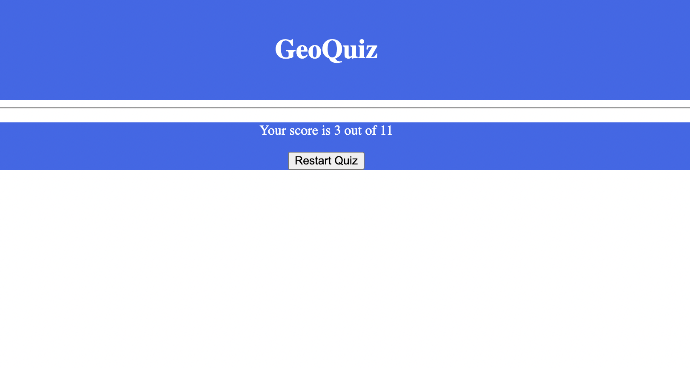

# GeoQuiz
The Quiz consists of 10 geography questions, each question 

View the live site <a href="https://joysalchert.github.io/JSalchert-pp2-geography-quiz/" target="_blank">here</a>

## Features
### Start page:
Header with GeoQuiz title and the Start button.
The js code creates all the questions with 4 possible answers (in the form of radio buttons + labels) and hides them.

### Questions pages:
The js code "unhides" one question card at a time. 
The user gets imediat feedback if his answer is correct or not in the form of red and green border color around the labels of the radio buttons.
Next question button moves the quiz to the next question.

### Score page:
After the full length of the questions array has been reached the quiz displays the users score out of a possible 10 correct answers. The Restart button brings the user back to the Start page with reinitialises the quiz.

## Technologies
- HTML: 
Was used to give the website its structure and semantic meaning.
- CSS: 
The website was styled with CSS on the style.css external file.
- GitHub: 
The Source code is hosted on GitHub and deployed via GitPages.
- Git: 
Used to commit and push code during the development of the website.

## Testing
- Responsivnes: 
The Website was tested on 3 devices (MacBookAir, iPadAir, iPhone13) and in developer tools. 
It passed my expectations.
- Bugs: 
I used the developer tools to debug the js code.

Testing focused on:
- Color contrasts meet minimum ratio set in WCAG 2.1 Contrast Guidlines.
- HTML page lang atribute is set.
- Adherence to the WCAG 2.1 Coding best practices.

## Deployment

- The site was created using the GidPod code editor and pushed to github to the repository (JSalchert-pp2-geography-quiz).
- I used the folowing comands to push the code from the GitPod Workspace to the repository:
> git add . 
> git commit -m "Message" 
> git push

- Deployment to Github Pages: 
I deployed the finished website to Gidhub Pages and got the folowing live link: 
https://joysalchert.github.io/JSalchert-pp2-geography-quiz/

## Credits
- I took the artikle "Quiz App Using HTML, CSS And JavaScript (Source Code) – Coding Torque"
Written by: Piyush Patil (Code Credits: @virtualwiz) as a guide!
- I took my mentors (Gareth McGirr) README.md file as the outline for my README.md file.
- I used generel google queries when I got stuck (mostly W3Schools material).

## Content and Media
I wrote all the HTML/CSS code.
